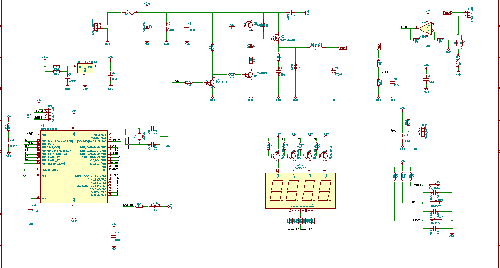
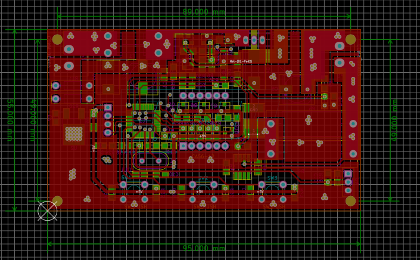
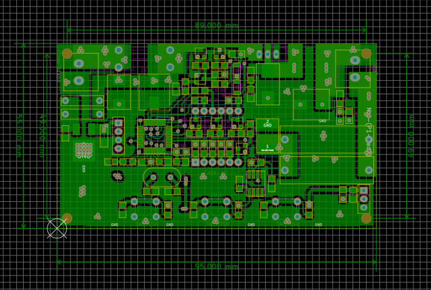
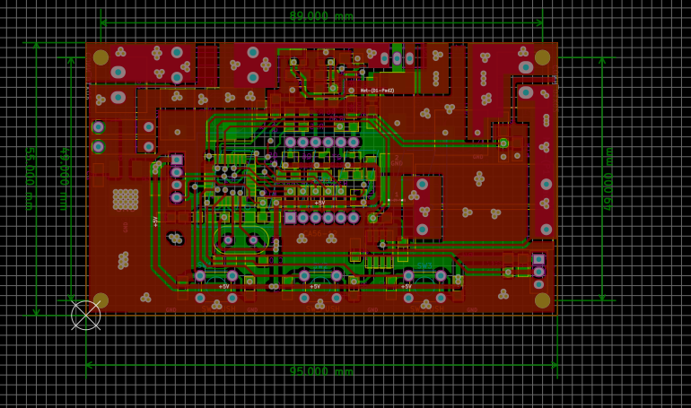
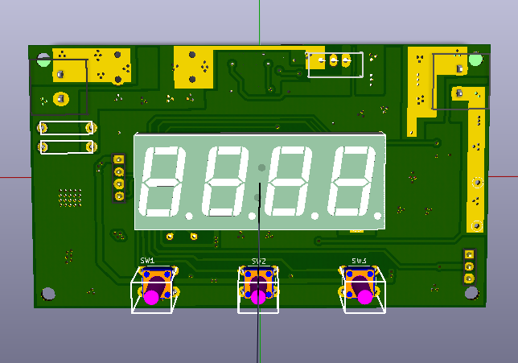
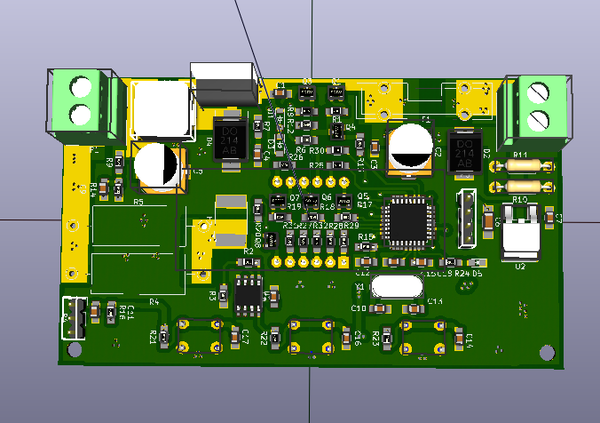

#DC-DC-converter using STM8

##Nguyên lý

- Mạch điều khiển công suất sò nóng lạnh

-- Điều khiển theo nhiệt độ

-- Điều khiển công suất ngõ ra

-- Mạch sử dụng VĐK STM8 đo dòng, đo áp, đo nhiệt độ điều khiển công suất ngõ ra

-- Nút mode chọn 3 chế độ: hiển thị dòng điện, điện áp, nhiệt độ.

-- Nhấn nút mode 3s vào chế độ setup, nhấp up, down chọn chế độ: set nhiệt độ, set dòng điện, nhấn mode vào chế độ đó, nhấn up down để tăng giảm từng đơn vị.

##Design

###_schematic_

###_pcb_

###_3d_

##Caculator

